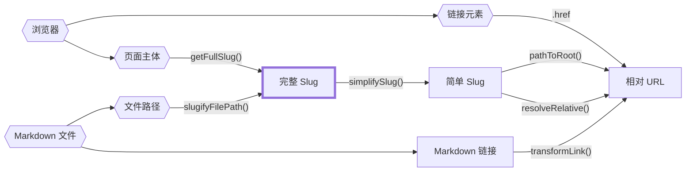

路径非常复杂，尤其是在静态网站生成器中，因为路径的来源非常多样。

一段内容的完整文件路径？这也是路径。内容的 slug？又是另一种路径。

如果只是简单地把这些都定义为 `string` 类型，显然不够，因为很容易把不同类型的路径搞混。不幸的是，TypeScript 对类型别名并没有[名义类型](https://zh.wikipedia.org/wiki/%E5%90%8D%E4%B9%89%E7%B1%BB%E5%9E%8B%E7%B3%BB%E7%BB%9F)的支持，这意味着即使你为服务端 slug 或客户端 slug 创建了自定义类型，依然可以互相赋值，TypeScript 也不会报错。

幸运的是，我们可以通过[品牌类型](https://www.typescriptlang.org/play#example/nominal-typing)来模拟名义类型。

```typescript
// 原本这样写
type FullSlug = string

// 现在这样写
type FullSlug = string & { __brand: "full" }

// 这样，下面的代码就无法通过类型检查
const slug: FullSlug = "some random string"
```

这种方式可以防止在名义类型系统内部（比如把服务端 slug 当成客户端 slug）的大部分类型错误，但如果你强制把一个字符串转换为这些名义类型，还是可能出错。

因此，在从字符串转换为这些名义类型的“入口点”处（下图中的六边形），我们仍然需要格外小心。

下图展示了所有路径来源、名义路径类型，以及 `quartz/path.ts` 中用于相互转换的函数之间的关系。



以下是主要的 slug 类型及其简要说明：

- `FilePath`：磁盘上真实文件的路径。不能是相对路径，且必须带有文件扩展名。
- `FullSlug`：不能是相对路径，且不能有前导或尾随斜杠。最后一段可以是 `index`。尽量使用此类型，因为它是 slug 最“通用”的解释。
- `SimpleSlug`：不能是相对路径，结尾不应为 `/index` 或文件扩展名。但可以有尾随斜杠，表示文件夹路径。
- `RelativeURL`：必须以 `.` 或 `..` 开头，表示相对 URL。结尾不应为 `/index` 或文件扩展名，但可以有尾随斜杠。

想要更清楚地了解它们之间的关系，可以查看 `quartz/util/path.test.ts` 中的路径测试用例。

