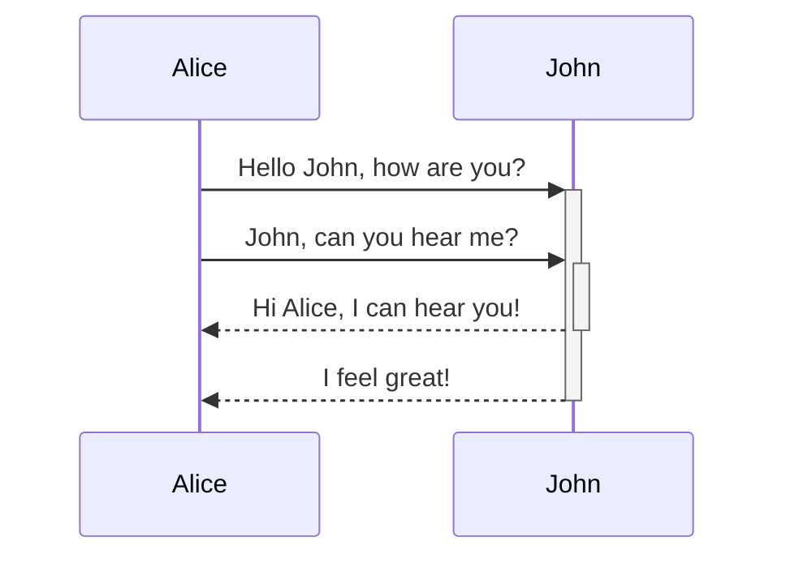

Quartz 支持 Mermaid，可以让你在笔记中添加图表和流程图。Mermaid 支持多种类型的图表，例如 [流程图](https://mermaid.js.org/syntax/flowchart.html)、[时序图](https://mermaid.js.org/syntax/sequenceDiagram.html) 和 [时间线](https://mermaid.js.org/syntax/timeline.html)。该功能作为 [[Obsidian compatibility]] 的一部分启用，并可通过该插件进行配置和启用/禁用。

默认情况下，Quartz 会根据站点主题渲染 Mermaid 图表。

> [!warning]
> 发现 Mermaid 图表没有显示，即使你已经启用了它？你可能需要调整插件顺序，让 [[ObsidianFlavoredMarkdown]] 在 [[SyntaxHighlighting]] 之后。

## 语法

要添加 Mermaid 图表，请创建一个 mermaid 代码块。

````

````


